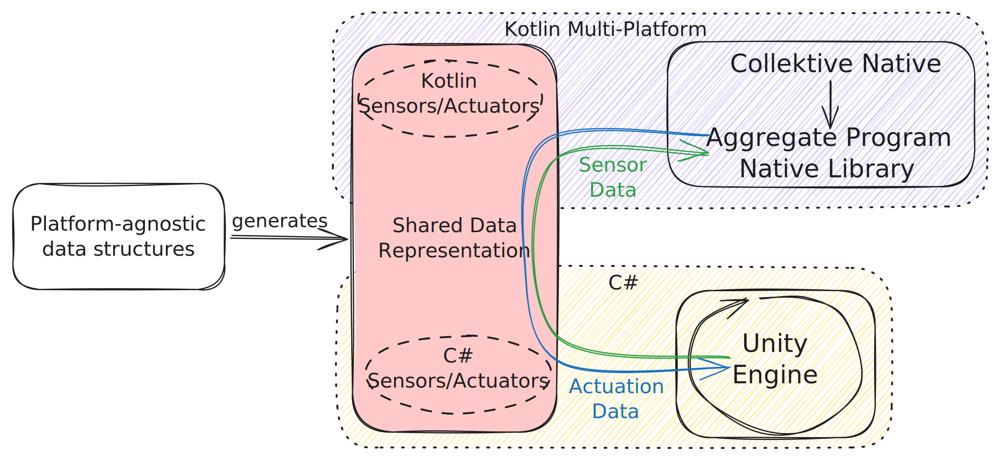
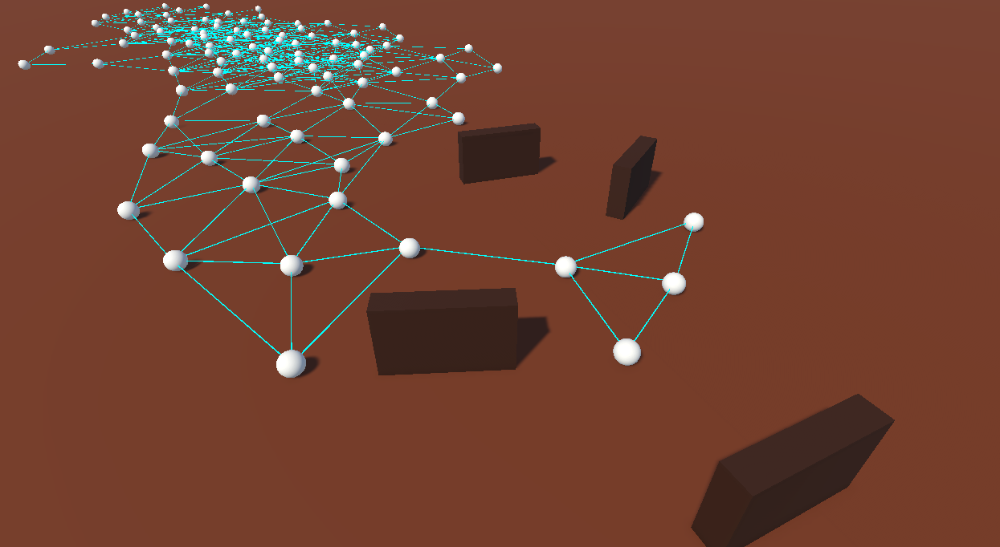

# Collektivity

This repository is a template for validating and testing aggregate applications written in [Collektive](https://github.com/Collektive/collektive) using [Unity](https://unity.com/) game engine as simulator.
This integration allows to test high-fidelity simulation of Collective Adaptive Systems (CASs), thanks to the powerful physics engine provived by the game development platform.
This project is equipped with two example scenarios to demonstrates the capabilities of the Unity engine to model three-dimensional simulations of nodes running aggregate computation.

### Companion artifact for the paper entitled _"High-Fidelity Simulation of Aggregate Computing Systems with Collektivity"_ 
Submitted to [Coordination 2025](https://www.discotec.org/2026/coordination) conference 
### Authors
- Filippo Gurioli (filippo.gurioli@studio.unibo.it)
- Martina Baiardi (m.baiardi@unibo.it)
- Angela Cortecchia (angela.cortecchia@unibo.it)
- Danilo Pianini (danilo.pianini@unibo.it)

## Details of the integration

Since the device behavior is defined by the aggregate program, 
while the environment behavior (including physics, position in the world, and neighborhood relationships) pertain to the game engine,
the natural division of responsibilities is to have the game engine provide sensory data to the aggregate program, while the aggregate program computes the actuation commands back to the engine.

This architectural choice implication is that, when designing new case studies, users must, as first step, define the data types that represent sensors and actuators.
This is done using [Protocol Buffers](https://protobuf.dev/).
Protocol Buffers (`protobuf`) is a language-neutral, platform-neutral mechanism for serializing structured data.
It defines data models using a declarative syntax (`.proto` files) that describes their structure in an implementation-agnostic way.
From a single `.proto` definition, the `protoc` compiler can generate serialization source code for multiple languages automatically, including `C#`, `Kotlin`, `Java`, and many others.

To work, the Unity game engine invokes the aggregate program directly through Foreign-Function Interface (FFI) giving `Sensor Data` information, 
which sends back its computation result as `Actuation Data`. 



## Directory structure
The directory structure for the Collektivity project is organized as follows:

```
collektivity/
├── collektive-backend/                                     # Backend library for Collektive computation
│   ├── lib/
│   │   ├── src/
│   │   │   ├── commonMain/
│   │   │   │   ├── kotlin/
│   │   │   │   │   └── it/unibo/collektive/unity/examples  # Collektive entrypoint for the aggregrate program
│   │   │   │   └── proto/
│   │   │   │       └── user-defined-schema.proto           # Protobuf definition for user defined data schema
│   │   │   └── ...
│   └── ...
├── Collektive.Unity/                                       # Unity engine integration to invoke Collektive computation
│   ├── Runtime/
│   │   ├── Node.cs                                         # Unity Game Object Behavior, allows the binding with Collektive computation
│   │   ├── Example/                                        # Example for a Collektive gradient descent logic specialization 
│   │   └── ...
│   of the `Node` class
│   └── ...
├── rich-scenario/                                          # Unity project for Rick Scenario Execution
│   ├── Assets/
│   │   ├── Scenes/
│   │   │   ├── Oasis/
│   │   │   │   └── Oasis.unity
│   │   │   └── ...
│   │   └── ...
│   └── ...
├── Sandbox.Collektive.Unity/                               # Unity project for Simple Scenario Execution
│   ├── Assets/
│   │   ├── Scenes/
│   │   │   └── Robots and Obstacles.unity
│   │   └── ...
│   └── ...
└── ...
```

## Requirements for executing the simulations

- Linux Operating System
- Unity 6000.3.8f1, downloadable from [Unity Hub](https://docs.unity3d.com/hub/manual/InstallHub.html)
- Java 21

## Instructions to launch the builtin examples

0. Clone the repository

### Simple Scenario
1. Open an unity editor project pointing at the `collektivity/Sandbox.Collektive.Unity` directory
2. On the top bar click `Tools` button and then launch both `Proto > Generate` and `Native > Rebuild backend`
3. From the `project` tab (usually at the bottom of the editor) open the `Assets/Scenes` directory and double click on the `Robots and Obstacles.unity` file to open the scene
4. Start the simulation by pressing the start button at the center top of the unity editor.



### Rich Scenario
1. Open an unity editor project pointing at the `collektivity/rich-scenario` directory 
2. On the top bar click `Tools` button and then launch both `Proto > Generate` and `Native > Rebuild backend` 
3. From the `project` tab (usually at the bottom of the editor) open the `Assets/Scenes/Oasis` directory and double click on the `Oasis.unity` file to open the scene 
4. Start the simulation by pressing the start button at the center top of the unity editor.


## Create a new cusotm simulation

1. Update the file at `collektivity/collektive-backend/lib/src/commonMain/proto/user-defined-schema.proto` indicating the data schema for `SensorData` and `ActuatorData`
    1. `SensorData` the data structure Unity will send to the Collektive computation 
    2. `ActuatorData` output obtained from Collektive computation that is sent back to Unity 
2. Launch `./gradlew build` inside the `collektive-backend` directory 
    1. this triggers the `proto` compiler to generate data structures in Kotlin anc C#, that will then be used in your code 
3. Update the `collketivity/collektive-backend/lib/src/commonMain/kotlin/it/unibo/collektive/unity/examples/UserDefinedEntrypoint.kt` the aggregate program you want to simulate 
4. Open the Uunity editor pointing at the `collektivity/Sandbox.Collektive.Unity` directory 
5. In the top bar click `Tools` button and then launch both `Proto > Generate` and `Native > Rebuild backend` 
6. Create your own node behavior by developing a specialization of the the `collektivity/Collektive.Unity/Runtime/Node.cs` class (a specialization of the Unity `MonoBehaviour`) 
    1. Implement the abstract methods `Act` and `Sense` 
7. In the Unity editor, create a new scene and add your game objects to the scene, these will represent the node executed by the simulation
8. Attach to those game objects the new class you've implemented as a specialization of `Node` 
9. Add the `Simulation Manager` prefab to the scene (can be found at `collektivity/Collektive.Unity/Runtime/Prefabs/Simulation Manager.prefab`) 
10. Create a new `MonoBehaviour` that interact with the `SimulationManager.Instance` singleton APIs to choose a neighborhood logic (see the `ProximityNeighborhoodBehaviour` in the `collektive.unity/Collektive.Unity/Runtime/Example/` directory for an example)
    1. Attach to your game object the newly implemented neighboorhood logic
12. Start your simulation by pressing the start button at the center top of the unity editor.
